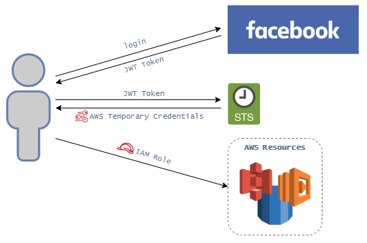

# AWS CLI 


<p>&nbsp;</p>

O AWS CLI (command line interface) é uma ferramenta da aws que possibilita o gerenciamento de nossa conta assim como de nossos recursos de forma unificada. Através dele podemos criar, alterar e remover recursos utilizando o próprio cli, além de automatizar operações através de scripts.

> Atualmente AWS CLI é compatível com os seguintes sistemas operacionais: Windows, Linux and MAC.

## Pagination

Caso o resultado de alguma operação envolvendo o CLI retorne um erro de *Timed Out*, pode-se imaginar que é devido a quantidade de informações solicitadas pelo comando.

Temos algumas formas de resolver o problema, a primeira é a utilização do paramêtro ```--page-size``` e a segunda é definindo um valor máximo a ser retornado na operação através do paramêtro ```--max-items```.

### Page Size

```aws s3api list-objects --bucket BucketName --page-size 100```

Utilizando o comando acima com o paramêtro de paginação, ele irá sobrescrever o valor default de 1000 para o valor informado pelo usuário (100), irá realizar múltiplas (10) chamadas em background, capturar os retornos e mostrar o resultado da operação solicitada.

### Max Items

```aws s3api list-objects --bucket BucketName --max-items 100```

Já utilizando o paramêtro --max-items, estamos definindo o valor máximo de itens a serem retornados, assim ele irá apenas retornar os primeiros itens de acordo com a quantidade informada pelo usuário (10).

## STS

Através da Api do STS (**Security Token Service**) é possível **conceder acesso temporário**, por meio de **credenciais com privilégio limitados** para usuários autenticados utilizando um *web identity provider* (*federated users*).

### AssumeRoleWithWebIdentity

Através do endpoint ```AssumeRoleWithWebIdentity``` é possível por conceder credenciais de acesso temporário para usuários que foram autenticados em uma aplicação web ou mobile através de um *web identity provider*. 

Seu fluxo é bem parecido com o fluxo realizado pelo identity pools, porém quem realiza a troca do JWT para as credenciais da aws, neste caso é a API do STS.



Exemplo de response:
```xml
<AssumeRoleWithWebIdentityResponse xmlns="https://sts.amazonaws.com/doc/2011-06-15/">
  <AssumeRoleWithWebIdentityResult>
    <SubjectFromWebIdentityToken>amzn1.account.AF6RHO7KZU5XRVQJGXK6HB56KR2A</SubjectFromWebIdentityToken>
    <Audience>client.5498841531868486423.1548@apps.example.com</Audience>
    <AssumedRoleUser>
      <Arn>arn:aws:sts::123456789012:assumed-role/FederatedWebIdentityRole/app1</Arn>
      <AssumedRoleId>AROACLKWSDQRAOEXAMPLE:app1</AssumedRoleId>
    </AssumedRoleUser>
    <Credentials>
      <SessionToken>AQoDYXdzEE0a8ANXXXXXXXXNO1ewxE5TijQyp+IEXAMPLE</SessionToken>
      <SecretAccessKey>wJalrXUtnFEMI/K7MDENG/bPxRfiCYzEXAMPLEKEY</SecretAccessKey>
      <Expiration>2014-10-24T23:00:23Z</Expiration>
      <AccessKeyId>ASgeIAIOSFODNN7EXAMPLE</AccessKeyId>
    </Credentials>
    <SourceIdentity>SourceIdentityValue</SourceIdentity>
    <Provider>www.amazon.com</Provider>
  </AssumeRoleWithWebIdentityResult>
  <ResponseMetadata>
    <RequestId>ad4156e9-bce1-11e2-82e6-6b6efEXAMPLE</RequestId>
  </ResponseMetadata>
</AssumeRoleWithWebIdentityResponse>
```

Dos dados retornados, os principais são o ```AssumedRoleUser.Arn``` e ```AssumedRoleUser.AssumedRoleId``` que representam a role temporária criada e o ```Credentials.SecretAccessKey``` e ```Credentials.AccessKeyId``` que são os dados programáticos a qual serão utilizados para conseguirmos nos comunicar com os serviços da aws temporariamente.

> Importante lembrar que para aplicações mobile, a AWS fortemente indica a utilização do Cognito em vez do uso da API do STS para concessão das credenciais.

## Best practices

- **Least Privilege** - Sempre de o mínimo acesso necessário.
- **Use Groups** - Utilize grupos para gerenciamento de permissões e adicione os usuários necessitam herdar as permissões necessárias para aquele grupo.
- **Private Key Pairs** - Cada desenvolvedor deverá ter sua própria key pair.

## Remember

Lembre-se que a visualização da sua Secret Access Key é única, em caso de perda, você deverá criar uma nova.

## Tips

- O AWS CLI STS AssumeRoleWithWebIdentity retorna as credenciais temporárias assim como o AccessKeyId, SecretAccessKey e um security token além do ARN e o AssumedRoleId que o usuário poderá assumir.

- Se estivermos recebendo o retorno de timeout durante a listagem de recursos, podemos diminuir o page-size.

- O AWS possui um cli específico para criptografia chamada aws encryption CLI a qual usa por baixo dos panos a AWS Encryption SDK.

- 