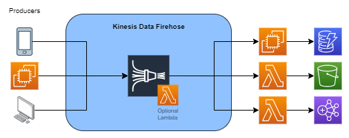
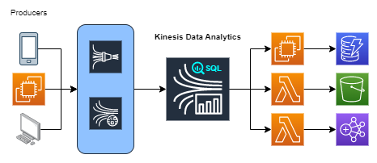

# AWS Kinesis

&nbsp;

AWS Kinesis is collection of **analytics services** responsible to **collect**, **process** and **analyse streaming data**.

O Kinesis é utilizado para coletar centenas de milhares de dados que estão sendo streamados continuamente por diferentes origens simultaneamente em pequenos tamanhos, geralmente kbytes.

## Kinesis Types

### Kinesis Data Streams

Os **Data Streams** permitem a integração com aplicações customizadas para **processamento** dos dados capturados em **tempo real**. 

A arquitetura dos data streams prevê sempre um consumidor que ficará responsável por realizar o pulling nos shards para o processamento dos dados.

Ele funciona à partir da utilização de **shards**, local em que os dados são armazenados, enquanto aguardam para serem capturados por um consumidor que irá processar os dados e enviar para algum serviço como, dynamo, s3, EMR e Redshift.

O que define a capacidade de streaming é justamente o número de shards, portanto se a volumetria dos dados aumentar, para aumentar o capacidade de streaming do kinesis, você deve aumentar também o número de shards.

Cada registro possui um número sequencial que o identifica, portanto a **ordem** dos dados **sempre é mantida**.

Os **shards** possuem um **período de retenção** entre **24 horas** e **365 dias**.

Ele é dividido em dois serviços: **data streams** and **video streams**.

#### Kinesis Shards & Consumers

O consumo dos *shards* é feito através do **Kinesis Client Library (KCL)**, responsável por realizar o consumo dos dados entre todas as instâncias de consumidores através dos **Record Processors**. Por meio do KCL, a divisão dos *Record Processors* é realizado de forma nativa, funcionando como se fosse um load balancer.

Dessa forma, toda vez que fizermos o **resharding** (aumentar o número de *shards*) a própria library do kinesis irá identificar esta alteração e adicionar o número de *Record Processors* necessários, mantendo sempre o número de *shards* igual ao número de *record processors*.

> Não é porque adicionamos novos *shards* que devemos adicionar novas instâncias. Pelo contrário, se quisermos ter um *auto scaling group* em nossos consumidores, devemos nos basear no CPU de cada instância e não no número de *shards*.
>
> O número de consumidores nunca pode ser superior ao número de shards. Por exemplo, se tivermos 4 shards devemos ter no máximo 4 instâncias para consumo.

Representação dos shards entre os consumidores:

### Kinesis Data Firehose

O Firehose permite a **captura**, **transformação** e **carregamento** dos streams para análise do dados quase em tempo real através de ferramentas de BI.

Diferente do data streams, o firehose não possui shards, portanto os **dados coletados não são retidos**, porém não há necessidade de consumidores. Os dados coletados podem opcionalmente serem transformados por uma lambda e depois enviados ao S3 e após ao redshift ou somente enviados ao opensearch.

Prevê a utilização de ferramentas de BI para análise dos dados quase em tempo real.

### Kinesis Data Analytics

O Data Analytics permite a análise, querying e **transformação dos dados em tempo real através de SQL**.

Basicamente, pode utilizar o data streams ou firehose para coleta dos dados, porém utiliza queries SQL para transformação dos dados e envio ao s3, redshift ou opensearch.

## Tips

- O Kinesis pode ser usado junto ao WAF para capturar informações referentes ao Web ACL.

- O Kinesis Data Streams possui um registro ordenado, real time, é uma possível mais flexível entre os possíveis destinos e eventualmente mais barato que o Firehose.

- O Kinesis Data Streams pode armazenar os dados por até 365 dias, inclusive, os dados consumidos posteriormente também serão ordenados.

- O Kinesis Data Firehose é near real time, comunica-se praticamente com o S3, RedShift e ElasticSearch e possibilita uso de ferramentas de BI.

- A partition key do Kinesis Data Streams é usada para segregar data records que pertencem a um stream em múltiplos shards. Caso a partition key não esteja distruída corretamente, os dados ficarão "presos" em apenas alguns shards, não utilizando todos os shards disponíveis, tendo hot "shards" e "cold" shards.

- A maneira mais ideal de configurar o Kinesis Data Streams é através do Kinesis Agent instalado em cada um dos consumidores (ec2). Através dele temos monitoramento constante dos arquivos, envio de novos dados além de feature como: file rotation, checkpointing e retry upon failures.

- O Kinesis Producer Librar (KPL) é uma lib, ou seja, uma abstração para facilitar envio de dados ao Kinesis Data Streams.

- O Elasticache não é uma opção válida como destino do Kinesis Data Firehose.