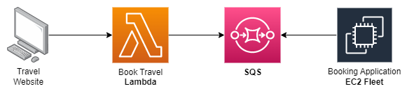

# Amazon SQS - Simple Queue Service

&nbsp;

Amazon SQS is a **serverless message queueing service**, responsible for **decoupling your infrastructure**.

O SQS sempre deve ser uma opção quando é necessário **desacoplarmos** nossas aplicações.

## How SQS Works?

Devido tratar-se de uma serviço de mensageria, para funcionar depende necessariamente de um produtor e pelo menos um consumidor.

O produtor fica responsável por enviar novas mensagens a fila a qual serão recebidas e processadas pelo consumidor.

Um ponto importante para lembrarmos é que o SQS utiliza um sistema **pull-based**, para captura das mensagens, ou seja, as nossas instâncias ficarão realizando o pulling na fila do SQS para capturar novas mensagens.

## SQS Types

- Standard Queue (Default)
- FIFO Queue

**Standard Queue** | **FIFO Queue** |
:----------------- | :------------- |
Pode ser entregue **fora de ordem** | **Ordem preservada** |
Mensagens são entregues **pelo menos 1** vez | Mensagens são entregues **apenas 1** vez |
Pode haver mensagens **duplicadas** | Mensagens **únicas** |
**Default** (padrão) - Usada na maioria dos cenários | Deve ser usadas em aplicações em que ordenação e idempotência deve ser garantida por padrão, exemplo: banking apps |

## Short Polling x Long Polling

Basicamente temos duas opções de polling, a primeira é o **Short Polling** que basicamente **sempre retorna uma response**, mesmo que não tenha nenhuma mensagem para ser consumida, podendo ter aumento nos custos, visto que a cobrança é por requisições. A segunda opção é o **Long Polling**, a qual o polling será **realizado periodicamente** e somente retornará uma response quando uma **nova mensagem estiver presente** para ser consumida ou o **tempo de timed for alcançado**.

> Sempre que possível devemos optar pelo Long Polling visto que é uma opção mais rentável.

## Features

- [Visibility Timeout](#visibility-timeout)
- [SQS Delay Queues](#sqs-delay-queues)

### Visibility Timeout

Uma das principais características do SQS é a segurança no processamento de mensagens, através do **Visibility Timeout**, que é o número de tempo em segundos que a mensagem ficará invisível para outros consumidores durante seu processamento. Caso aconteça algo com o consumidor e a mensagem não consiga ser processada corretamente, a mensagem irá retornar a fila quando o tempo de visibilidade acabar.

O Visibility Timeout por **default** é de **30 segundos** e podemos aumentar até o **máximo de 12 horas**.

> Importante lembrar que caso suas mensagens estejam sendo processadas mais de uma vez, uma das causas é que o tempo de processamento é inferior ao *visibility timeout*. Para resolvermos o problema devemos aumentar o tempo dado ao *visibility timeout* ou diminuir o tempo de processamento da mensagem.

### SQS Delay Queues

Está é uma feature a qual permite aplicar um delay na fila assim toda nova mensagem que chegar na fila ficará invisível durante aquele período de tempo configurado. É uma opção para aplicações que necessitam esperar por um tempo antes de serem processadas.

O tipo de fila utilizado também implica em algumas particularidades para cada uma delas, nas filas do tipo standard esta nova configuração apenas surtirá efeito em novas mensagens e em filas do tipo fifo será aplicado também para mensagens que já estejam na fila.

O tempo **default é 0 segundos** e pode ser até no **máximo 900 segundos**.

## Characteristics of the messages

As mensagens tem **tamanho máximo de 256 kbytes** e podem ser enviadas nos seguintes formatos de texto: **json**, **xml** e **plaintext** (texto puro).

O período de retenção (***retention period***) **default** é de **4 dias**, porém podendo ser entre 1 minuto e **máximo** de **14 dias**.

Uma garantia que temos com o SQS é que todas as mensagens serão processadas ao menos uma vez.

### How to deal with bigger messages?

Para mensagens com tamanho superior a 256 kbytes até 2GB, será necessário utilizarmos o **S3** para armazenamento de mensagens, o **SQS SDK** e utilizarmos a **ExtendedClient library** da linguagem que você estiver trabalhando.

O fluxo se dá por meio do armazenamento da mensagem no s3, envio de identificador desta mensagem através do sqs, a qual será capturado pelo consumidor para fazer o download da mensagem e exclusão após o seu processamento.