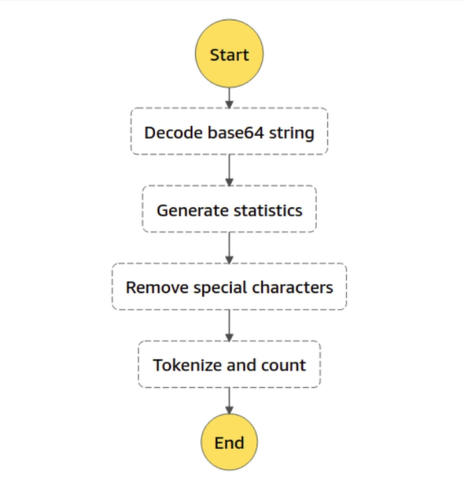
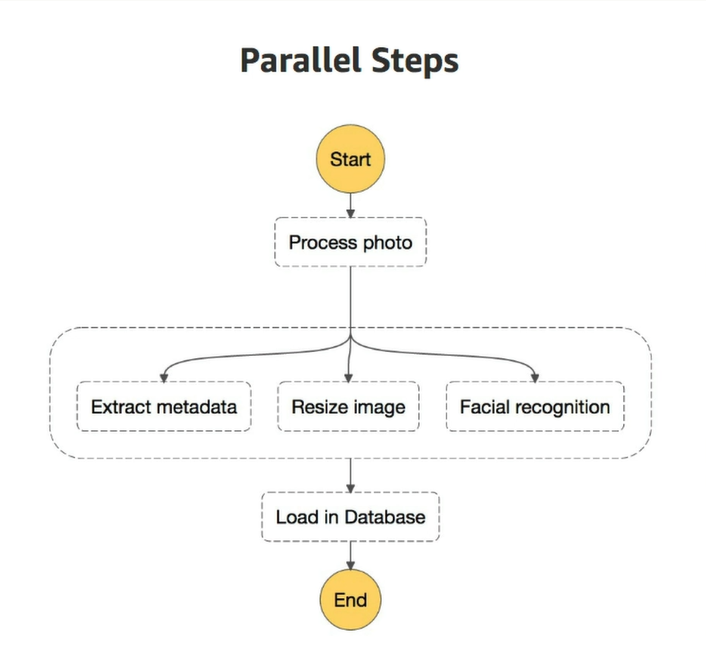
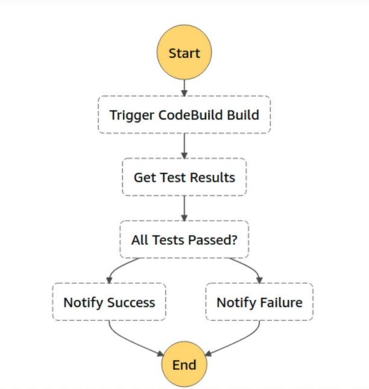

# AWS Step Functions

&nbsp;

AWS Step functions is an **orchestration service for serverless applications**.

Por meio deste serviço é possível **criar**, **alterar** e **visualizar fluxos** utilizando uma **combinação de lambdas** como sendo uma série de steps.

Cada step é executado de acordo com a regra de negócio, sendo o output de uma lambda o input de outra lambda em sequência.

## Features

- **Sequencing** - Execução automática de cada step em ordem (*automatically trigger and track each step*)
- **Error Handling** - Tratativa de erros.
- **Retry Logic** - Permite o retry nativamente entre os steps caso aconteça inesperado.
- **Logging state of each step** (*debug and troubleshooting*) - Realiza o *logging* do estado em cada *step*, possibilitando a análise e facilitando a identificação e correção de possíveis problemas.

## Key Words

- **State Machine** - O próprio workflow
- **Task** - Cada step (lambda)

## Workflow Types

### Sequential Workflow

### Parallel Workflow

### Branching Workflow

