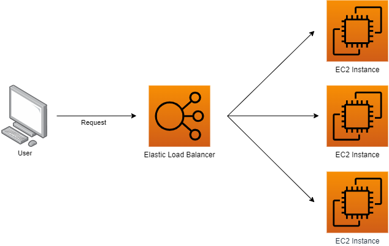
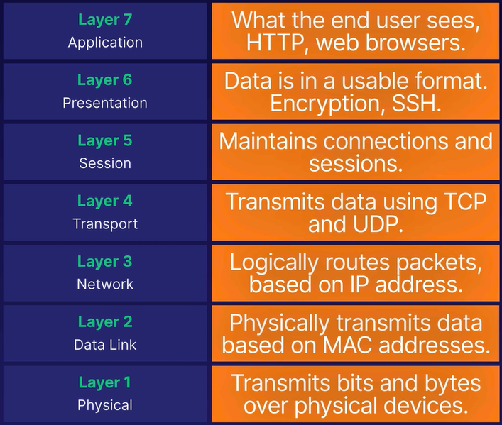
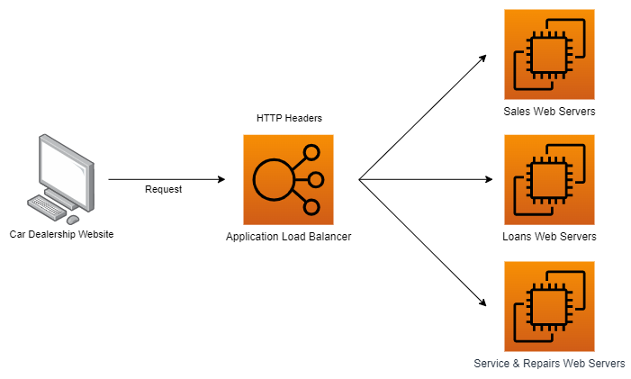

# ELB - Elastic Load Balancer

&nbsp;

ELB is an EC2 feature responsible for automatically distribute incoming application traffic across multiple targets and virtual appliances in one or more AZs.

    

## Types

- [**Application Load Balancer**](./README.md#application-load-balancer-alb) - ALB
- [**Network Load Balancer**](./README.md#network-load-balancer-nlb) - NLB
- [**Gateway Load Balancer**](./README.md#gateway-load-balancer-glb) - GLB
- [**Classic Load Balancer**](./README.md#classic-load-balancer-clb) (legacy)

### OSI Layers

### Application Load Balancer (ALB)

Realiza o balanceamanto de carga através das portas 80 (HTTP) and 443 (HTTPS). É considerado um balanceamento inteligente visto que ele pode capturar informações da aplicação (digamos que ela é *"application aware"*) e criar requisições de roteamento avançadas/customizadas utilizando inclusive paramêtros do cabeçalho da requisição (*HTTP headers*) durante o balanceamento dos workloads devido o balanceamento ocorrer na camada 7 (application).

    

### Network Load Balancer (NLB)

O balancemanto de carga é realizado através dos protocolos TCP/UDP, operando na camada 4 (*transport*) sendo o balanceamento mais performático, capaz de lidar com milhões de requisições por segundo. Deve ser usado por aplicações em que a performance é de extrema importância, visto que ele possui o maior preço também.

### Gateway Load Balancer (GLB)

Permite o balanceamento de carga de aplicações de terceiros, como aplicações compradas no marketplace, virtual firewalls de companhias como Fortnet, Palo Alto, Juniper e Cisco, além de sistemas IDS/IPS de empresas como CheckPoint, Trend Micro, entre outras.

### Classic Load Balancer (CLB)

É o tipo mais antigo, podendo realizar o balanceamento em ambas camadas (4 e 7), porém não é possível criar regras de roteamento customizadas igual ao ALB e nem atingir o mesmo tipo de performance do NLB.

Features
- X-Forwarded-For headers
- Sticky sessions

**X-Forwarded-For Headers**

É uma feature que permite que identificarmos o IP de origem de uma requisição após ela ser roteada através de um load balancer, incluindo o valor do ip de origem dentro do header, para ser capturado pelo web server.

    

## Common ELB Errors

### 504 - Gateway Timeout

Geralmente este erro ocorre quando o load balancer não consegue estabelecer a conexão com o target, sendo ele um web server, uma base de dados ou uma lambda. Indica geralmente que a aplicação está com problemas ou até fora do ar.