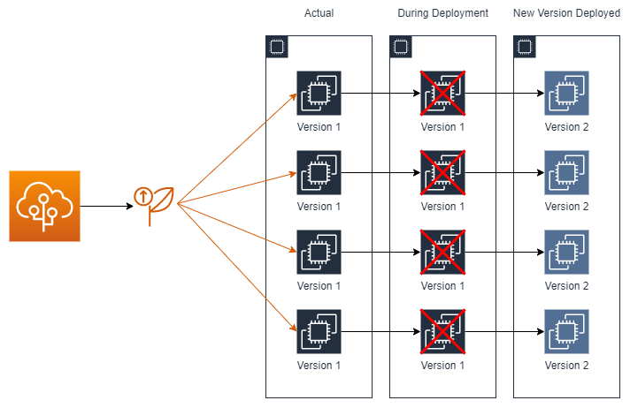

# AWS Elastic Beanstalk

&nbsp;

AWS Elastic Beanstalk is a **compute service** that helps to **deploy and scale web applications**.

O Elastic Beanstalk é o serviço mais **fácil e rápido** de se realizar **deploys e escalar aplicações web**. Através dele podemos apenas nos concentrar em nosso código pois ele fica responsável por prover os recursos necessários, realizar o update da aplicação e sistema operacional, além de possuir monitoramento, métricas e health checks inclusos.

O controle dos recursos pode ficar apenas como responsabilidade do Beanstalk, porém é possível "assumir o controle" e gerenciar os recursos por conta própria, alterando suas configurações, como também alterar a arquitetura provisiondada por ele.

## Deployment Types

### All At Once Deployment

Realiza o deploy em todas as instâncias de uma só vez. Implica interrupção total do serviço durante o deploy, o mesmo ocorre em cenário de rollback.

### Rolling Deployment (Batches)

Capacidade reduzida durante o deploy, pois uma parte (batch) ficará indisponível enquanto o deploy é realizado, tendo perda partical na capacidade, o mesmo cenário ocorre para o rollback.

### Rolling Deployment Additional Batch

Mantém a capacidade total durante o deploy.

### Immutable Deployment

O deploy consiste em subir primeiro as novas instâncias que possuem a nova versão, após passar pelos health checks, irá matar as antigas instâncias e permanecer com as novas. Não possui downtime, 0 impacto de capacidade ou interrupção para aplicação durante o deploy.

### Traffic Splitting

Deploy ocorre da mesma forma do immutable porém somente parte das requisições são direcionadas para esta nova versão, permite ***Canary Testing***.

## Programming Languages

As linguagens permitidas atualmente são: .NET, Java, PHP, Python, Ruby, Go e NodeJs.

## Managed Platforms

Podemos realizar o deploy da nossa aplicação em um servidor Apache Tomcat ou realizar o deploy através de uma imagem/container via Docker.

## AWS Resources

Alguns dos recursos que o Beanstalk pode promover são: EC2, RDS, S3, Elastic Load Balancer, Auto Scaling Groups, entre outros.