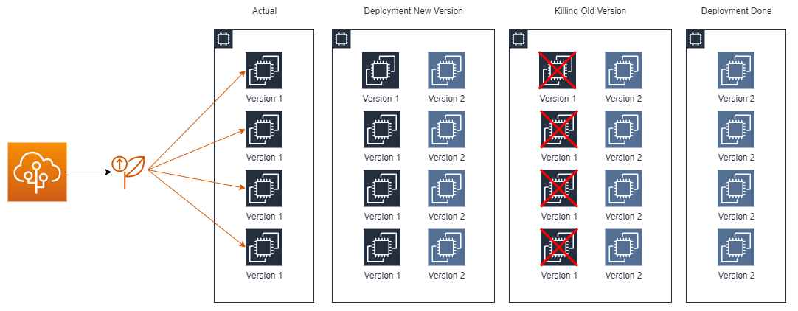

# AWS Elastic Beanstalk


<p>&nbsp;</p>

AWS Elastic Beanstalk is a **compute service** that helps to **deploy and scale web applications**.

O Elastic Beanstalk é o serviço mais **fácil e rápido** de se realizar **deploys e escalar aplicações web**. Através dele podemos apenas nos concentrar em nosso código pois ele fica responsável por prover os recursos necessários, realizar o update da aplicação e sistema operacional, além de possuir monitoramento, métricas e health checks inclusos.

O controle dos recursos pode ficar apenas como responsabilidade do Beanstalk, porém é possível "assumir o controle" e gerenciar os recursos por conta própria, alterando suas configurações, como também alterar a arquitetura provisiondada por ele.

> Para realizar o deploy de novas versões basta subirmos a nova versão para o elastic beanstalk, selecionarmos o environment (ambiente) e pronto, o elastic beanstalk se encarregará de fazer o deploy de acordo com as configurações presentes na seção **rolling updates and deployments**.

## How to Customize EB Environment?

Podemos customizar nossos ambientes através de diferentes maneiras. A primeira diferença que temos é devido ao tipo de sistema operacional que estamos utilizando, divididos em Amazon Linux 1 e 2.

Em instâncias do tipo **Amazon Linux 1**, devemos criar um folder chamado ```.ebextensions``` na raíz (top-level directory) do bundle da aplicação e os arquivos devem possuir a extensão ```.config```, como por exemplo: ```myautoscaling.config```.

Em instâncias do tipo **Amazon Linux 2**, podemos criar um arquivo chamado ```Buildfile``` no diretório raíz da nossa aplicação para comandos que são finalizados após execução (exemplo: shell scripts). Podemos criar um arquivo chamado ```Procfile``` para processos de longa duração (*long-running processes*) e também podemos criar **Platform Hooks** de acordo com o seguinte exemplo: ```.platform/hooks/ENVIRONMENT_NAME```, para execução de scripts e executáveis em diferentes estágios do provisionamento das instâncias EC2. 

> Os environments podem ser: ```prebuild```, ```predeploy``` e ```postdeploy```.
>
> Exemplo: ```.platform/hooks/prebuild```

## RDS Inside x Outside Beanstalk Environment

Basicamente temos duas formas de integrarmos nosso *environment* do Beanstalk com uma base de dados RDS, porém devemos nos atentar aos detalhes de cada uma.

### RDS Inside Beanstalk

Neste primeiro cenário nosso RDS fica junto aos outros recursos dentro do próprio *environment* do Beanstalk. Porém esta opção não deve ser utilizada em um ambiente produtivo, pois caso seja necessário realizar o *shut down* do *environment*, perderemos todo os dados presentes em nossa base de dados, pois ela será excluida juntamente ao nosso *environment*. Deve ser uma opção apenas para os ambientes de *dev* e *testing*.

### RDS Outside Beanstalk

Neste segundo cenário, nossa base de dados RDS fica apartada, assim caso seja necessário realizar o shut down do *environment*, não teremos impactos em nossa base de dados. Este cenário é aconselhável para um ambiente produtivo.

Porém, para estabelecermos essa integração devemos:

1. Criar um *security group* adicional.
2. Informar a *connection string* e *database password* nas *environment properties* do *beanstalk environment*.

## Deployment Types

### All At Once Deployment

Realiza o deploy em todas as instâncias de uma só vez. Implica interrupção total do serviço durante o deploy, o mesmo ocorre em cenário de rollback.


### Rolling Deployment (Batches)

Capacidade reduzida durante o deploy, pois uma parte (batch) ficará indisponível enquanto o deploy é realizado, tendo perda parcial na capacidade, o mesmo cenário ocorre para o rollback.


### Rolling Deployment Additional Batch

Mantém a capacidade total durante o deploy.


### Immutable Deployment

O deploy consiste em subir primeiro as novas instâncias que possuem a nova versão, após passar pelos health checks, irá matar as antigas instâncias e permanecer com as novas. Não possui downtime, 0 impacto de capacidade ou interrupção para aplicação durante o deploy.



### Traffic Splitting

Deploy ocorre da mesma forma do immutable porém somente parte das requisições são direcionadas para esta nova versão, permite ***Canary Testing***.

## Migrating existing .NET applications

A AWS aconselha o uso de uma ferramenta chamada **Windows Web Application Migration Assistant** para migração de aplicações .NET que estão atualmente rodando em *windows servers* em seu próprio data center para o *elastic beanstalk*.

É uma ferramenta *open source*, que utiliza *PowerShell* por debaixo dos panos para realizar a migração da aplicação, ela também é usualmente chamada de **.NET Migration Assistant** pela comunidade.

## Programming Languages

As linguagens permitidas atualmente são: .NET, Java, PHP, Python, Ruby, Go e NodeJs.

## Managed Platforms

Podemos realizar o deploy da nossa aplicação em um servidor Apache Tomcat ou realizar o deploy através de uma imagem/container via Docker.

## AWS Resources

Alguns dos recursos que o Beanstalk pode promover são: EC2, RDS, S3, Elastic Load Balancer, Auto Scaling Groups, entre outros.