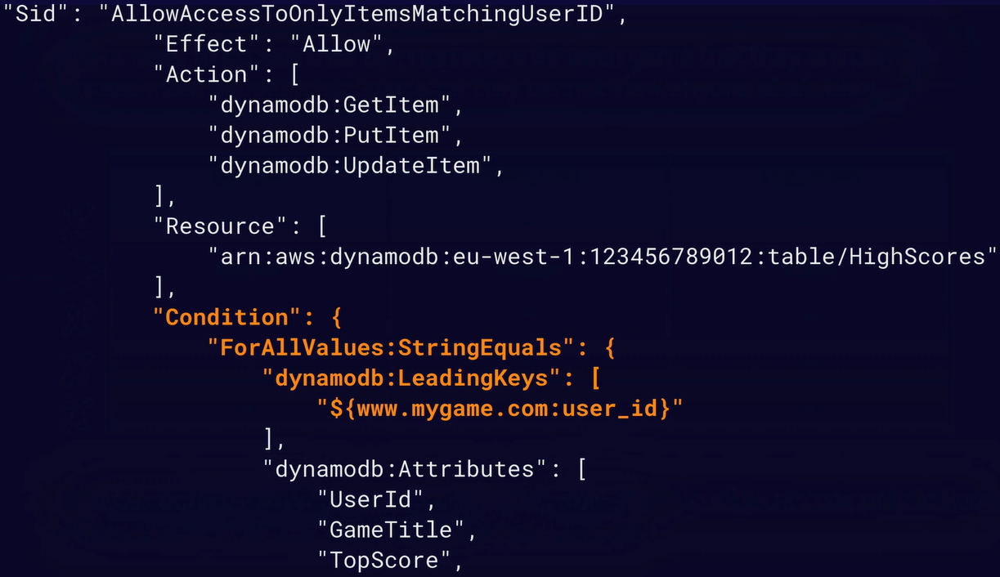

# Amazon DynamoDB


<p>&nbsp;</p>

DynamoDB is aws' own NoSQL Database.

## The 'Pros' of DynamoDB 

- **Fast And Flexible** - Consistente e ainda com uma latência inferior a alguns milissegundos (extremamente performático).
- **Fully Managed** - Possui suporte para modelos *key-value pair*. Os tipos suportados são: JSON, HTML e XML.

## Features

- [Support for ACID Transactions (*DynamoDB transactions*)](#dynamodb-transactions)
- [DynamoDB Indexes](#dynamodb-indexes)
- [Query & Scans](#query-and-scans)

### DynamoDB Transactions

O dynamo possui suporte para ***All-Or-Nothing transactions***, ou seja, caso seja necessário concluirmos uma série de passos antes de criarmos ou atualizarmos um registro no banco de dados, através do dynamodb transactions é possível.

> *ACID Transactions* é um acrônimo para *Atomic Consistent Isolated Durable transactions*.

### DynamoDB Indexes

O dynamodb também permite a criação de indexes em suas tabelas, permitindo maior flexibilidade e rapidez na captura de alguns dados, que não necessariamente dependem da partition key.

Os indexes são divididos em dois tipos: **Local Secondary Index** e **Global Secondary Index**.

#### Local Secondary Index

Podem ser criados **somente** no momento de **criação da tabela**, eles utilizam a **mesma partition key** (pk) porém **diferente sort key**.

#### Global Secondary Index

São muito mais flexíveis, podem ser **criados a qualquer momento**, não dependem da partition key, podendo escolher **qualquer atributo como pk e sk**.

### Query And Scans

#### Queries

As Queries são o modo mais performático de capturarmos dados no dynamodb, porém a partition key é obrigatória e a sort key opcional em qualquer busca.

Caso exista uma sort key, os resultados retornados sempre serão ordenados por ela, se ele for numérico será ordenado na ordem crescente e se for ASCII, utilizará o valor de cada uma para ordenação. Porém é possível definir a propriedade ```ScanIndexForward``` para ```false``` e assim retornar na ordem inversa.

Por padrão as queries sempre utilizam o modelo de consistência eventual nas buscas, porém podemos explicitamente definir as queries para utilizarem o modelo de forte consistência.

Caso necesitamos apenas de algumas propriedades da tabela durante a consulta podemos defini-las utilizando *ProjectionExpressions*.

#### Scans

Os Scans são o modo menos performático possível de capturar dados, pois ele primeiramente (por padrão) irá carregar toda a tabela e após aplicar filtros em cima. As *ProjectionExpressions* também podem ser usadas nos scans.

Podemos aumentar a performance dos scans utilizando *Parallel Scans*, porém possui grande impacto na performance se a aplicação já estiver com um alto fluxo de consumo. Outra opção é definir um page size menor, assim ele irá realizar mais requisições em background, não causando um possível throttling na tabela para longas operações. E caso os scans sejam realmente necessários, uma última opção é duplicar os dados em 2 tabelas e usar uma somente para os scans e outra para o tráfego de workloads críticos.

> SEMPRE OPTE POR QUERIES EM VEZ DE SCANS!

## DynamoDB Access Control

O controle de acesso é realizado por meio do IAM através de duas formas: **IAM Permissions** para nossos usuários ou **IAM Roles**, podendo conceder inclusive acesso temporário.

### Restricting Access

Caso nossa aplicação tenha que restringir acesso permitindo ao usuário consumir apenas os próprios dados dentro da tabela, isso pode ser realizado através da alteração do **IAM Policy** adicionando uma **IAM Condition** que irá verificar se PK (partition key) da tabela corresponde ao id do usuário que está tentando consumir os dados através da propriedade ***dynamodb:LeadingKeys***, como pode ser visto no exemplo abaixo.



## Use Cases

Devido ao dynamo ser extremamente flexível, ele usualmente é uma boa opção em diversos tipos de aplicações, como *mobile*, *web*, *gaming*, *IoT* e outras aplicações.

## DynamoDB underlying architecture

- **SSD Storage** - Performance.
- **Spread across 3 distinct data centers** - Resiliência.

### DynamoDB Consistency Types

#### **Eventual Consistent Reads**

O modelo de leitura com consistência eventual deve ser uma opção quando é necessário melhor performance, pois para garantir uma melhor performance, ele pode ou não retornar os dados mais atualizados.

> Geralmente leva 1 segundo para os dados serem escritos nos 3 data centers. Portanto se tentarmos capturar o objeto que acabou de ser escrito ou atualizado dentro de 1 segundo, sua versão mais atualizada poderá ser encontrada ou não, por isso o nome de consistência eventual.

#### **Strongly Consistent Reads**

O modelo de leitura com 'forte' consistência deve ser uma opção quando é necessário garantirmos que estaremos sempre capturando o dado mais atualizado. Porém tem um impacto na performance, pois os 3 data center serão atualizados de uma só vez.

## How DynamoDB tables works?

O dynamodb internamente divide todos os itens do banco em pequenas partições que utilizarão a *partition key* como *hash* para identificar as partições e items consequentemente.

### Primary Key

A chave primária no dynamoDb pode ser de dois tipos: **Partition Key** e **Composite Key**.

#### Partition Key

A *partition key* deve sempre corresponder a um identificador (id) de um item no banco.

> Exemplo: customer_id=123456, onboarding_id=132456, document_number=123456.

#### Composite Key

A chave composta é uma **combinação única** entre a *partition key* e uma *sort key*, em que a *partition key* é geralmente um identificador, porém neste cenário, ele pode se repetir e uma sort key que juntamente a partition key irá identificar aquele item no banco.

> Exemplo: PartitionKey - document_number=123456, SortKey - course_name=aws_developer_course.