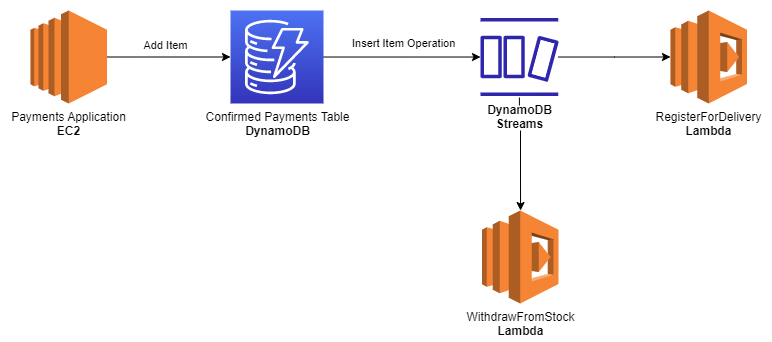

# Amazon DynamoDB


<p>&nbsp;</p>

DynamoDB is aws' own NoSQL Database.

## The 'Pros' of DynamoDB 

- **Fast And Flexible** - Consistente e ainda com uma latência inferior a alguns milissegundos (extremamente performático).
- **Fully Managed** - Possui suporte para modelos *key-value pair*. Os tipos suportados são: JSON, HTML e XML.

## Features

- [Support for ACID Transactions (*DynamoDB transactions*)](#dynamodb-transactions)
- [DynamoDB Indexes](#dynamodb-indexes)
- [Query & Scans](#query-and-scans)
- [DynamodDB Accelerator (DAX)](#dynamodb-accelerator-dax)
- [DynamoDB TTL](#dynamodb-ttl-time-to-live)
- [DynamoDB Streams](#dynamodb-streams)

### DynamoDB Transactions

O dynamo possui suporte para ***All-Or-Nothing transactions***, ou seja, caso seja necessário concluirmos uma série de passos antes de criarmos ou atualizarmos um registro no banco de dados, através do dynamodb transactions é possível.

> *ACID Transactions* é um acrônimo para *Atomic Consistent Isolated Durable transactions*.

### DynamoDB Indexes

O dynamodb também permite a criação de indexes em suas tabelas, permitindo maior flexibilidade e rapidez na captura de alguns dados, que não necessariamente dependem da partition key.

Os indexes são divididos em dois tipos: **Local Secondary Index** e **Global Secondary Index**.

#### Local Secondary Index

Podem ser criados **somente** no momento de **criação da tabela**, eles utilizam a **mesma partition key** (pk) porém **diferente sort key**.

#### Global Secondary Index

São muito mais flexíveis, podem ser **criados a qualquer momento**, não dependem da partition key, podendo escolher **qualquer atributo como pk e sk**.

### Query And Scans

#### Queries

As Queries são o modo mais performático de capturarmos dados no dynamodb, porém a partition key é obrigatória e a sort key opcional em qualquer busca.

Caso exista uma sort key, os resultados retornados sempre serão ordenados por ela, se ele for numérico será ordenado na ordem crescente e se for ASCII, utilizará o valor de cada uma para ordenação. Porém é possível definir a propriedade ```ScanIndexForward``` para ```false``` e assim retornar na ordem inversa.

Por padrão as queries sempre utilizam o modelo de consistência eventual nas buscas, porém podemos explicitamente definir as queries para utilizarem o modelo de forte consistência.

Caso necesitamos apenas de algumas propriedades da tabela durante a consulta podemos defini-las utilizando *ProjectionExpressions*.

#### Scans

Os Scans são o modo menos performático possível de capturar dados, pois ele primeiramente (por padrão) irá carregar toda a tabela e após aplicar filtros em cima. As *ProjectionExpressions* também podem ser usadas nos scans.

Podemos aumentar a performance dos scans utilizando *Parallel Scans*, porém possui grande impacto na performance se a aplicação já estiver com um alto fluxo de consumo. Outra opção é definir um page size menor, assim ele irá realizar mais requisições em background, não causando um possível throttling na tabela para longas operações. E caso os scans sejam realmente necessários, uma última opção é duplicar os dados em 2 tabelas e usar uma somente para os scans e outra para o tráfego de workloads críticos.

> SEMPRE OPTE POR QUERIES EM VEZ DE SCANS!

### DynamoDB Accelerator (DAX)

O DAX é um **serviço de memory cache** (*in-memory cache service*) para o dynamodb. Através dele podemos **diminuir o tempo de resposta** (*improve response time*) em operações de leitura para microsegundos.

Os dados são salvos no SSD interno do dynamodb e no DAX ao mesmo tempo.

É possível que sua aplicação tenha integração direta com o DAX, apontando as requisições diretamente para ele. Caso o item solicitado ainda não esteja em cache, ele irá realizar uma *GetItem operation* ao próprio dynamodb, salvar em memória e retornar ao usuário. Caso uma nova solicitação para o mesmo item seja feita, ele apenas irá retornar o item já *'cacheado'*.

O DAX é uma boa opção para aplicações que necessitam de uma melhoria no tempo de resposta na casa dos microssegundos e aplicações que realizam as mesmas consultas repetidas vezes e apenas pode ser usado em conjunto com o modelo de consistência eventual (*eventually consistency model*) nunca com o modelo de consistência forte (*strongly consistency model*).

Importante lembrar também que o DAX não deve ser uma opção em cenários em que é necessária uma melhoria na performance de escrita.

### DynamoDB TTL (Time To Live)

O DynamoDB TTL é uma feature permite a **remoção de itens** da tabela que **não são mais necessários** de forma **automática** pelo próprio dynamodb. 

Devemos possuir uma "coluna" (*attribute*) com dados no formato *Epoch Time* / *Unix Timestamp* e escolher esta "coluna" para ser utilizada pelo TTL.

Assim, sempre que o *Current Datetime* for maior que o valor indicado nesta "coluna", ele será marcado para remoção e em até 48 horas os itens serão removidos da tabela.

Esta feature é aconselhável em casos em que os itens não tem mais utilidade, são atualmente irrelevantes, dados temporários e até registros antigos, como por exemplo, dados de sessão do usuário e log de eventos muito antigos.


> A utilização do TTL pode implicar até em redução de custos da tabela, visto que estamos apagando dados irrelevantes, poupando armazenamento.

### DynamoDB Streams

É uma feature de **disparo de eventos ordenados** (sequencialmente por tempo) para **alterações nas tabelas** do dynamodb.

Através do DynamoDB Streams, é possível capturar qualquer alteração no estado dos itens armazenados na tabela, sejam eles, operações de **adição**, **atualização** ou **remoção**. Podemos ainda, '*triggar*' lambdas com base nestes eventos e assim realizar ações à partir das próprias tabelas.

Os dados destes eventos ficam armazenados em uma tabela específica do dynamodb streams por apenas 24 horas, podendo serem consultados por uma api específica (*aws dynamodbstreams*).

No exemplo abaixo, temos uma aplicação de pagamentos que possui uma tabela de pagamentos confirmados, no momento em que um novo pagamento é confirmado, um novo registro é inserido na tabela, o dynamodb streams captura o evento de inserção com os dados do produto e do pagamento e '*trigga*' duas lambdas responsáveis por retirar o produto do estoque e solicitar entrega do produto comprado.



## DynamoDB Access Control

O controle de acesso é realizado por meio do IAM através de duas formas: **IAM Permissions** para nossos usuários ou **IAM Roles**, podendo conceder inclusive acesso temporário.

Lembrando que as permissões também valem para as requisições feitas através do aws cli para as API's do dynamodb ou qualquer outro serviço.

Exemplo: Capturar um item da tabela

- Comando: ```aws dynamodb get-item``` 
- IAM Policy: ```dynamodb:GetItem:*```

### Restricting Access

Caso nossa aplicação tenha que restringir acesso permitindo ao usuário consumir apenas os próprios dados dentro da tabela, isso pode ser realizado através da alteração do **IAM Policy** adicionando uma **IAM Condition** que irá verificar se PK (partition key) da tabela corresponde ao id do usuário que está tentando consumir os dados através da propriedade ***dynamodb:LeadingKeys***, como pode ser visto no exemplo abaixo.


## How DynamoDB tables works?

O dynamodb internamente divide todos os itens do banco em pequenas partições que utilizarão a *partition key* como *hash* para identificar as partições e itens consequentemente.

### Primary Key

A chave primária no dynamoDb pode ser de dois tipos: **Partition Key** e **Composite Key**.

#### Partition Key

A *partition key* deve sempre corresponder a um identificador (id) de um item no banco.

> Exemplo: customer_id=123456, onboarding_id=132456, document_number=123456.

#### Composite Key

A chave composta é uma **combinação única** entre a *partition key* e uma *sort key*, em que a *partition key* é geralmente um identificador, porém neste cenário, ele pode se repetir e uma sort key que juntamente a partition key irá identificar aquele item no banco.

> Exemplo: PartitionKey - document_number=123456, SortKey - course_name=aws_developer_course.

## DynamoDB underlying architecture

- **SSD Storage** - Performance.
- **Spread across 3 distinct data centers** - Resiliência.

## DynamoDB Consistency Types

### **Eventual Consistent Reads**

O modelo de leitura com consistência eventual deve ser uma opção quando é necessário melhor performance, pois para garantir uma melhor performance, ele pode ou não retornar os dados mais atualizados.

> Geralmente leva 1 segundo para os dados serem escritos nos 3 data centers. Portanto se tentarmos capturar o objeto que acabou de ser escrito ou atualizado dentro de 1 segundo, sua versão mais atualizada poderá ser encontrada ou não, por isso o nome de consistência eventual.

### **Strongly Consistent Reads**

O modelo de leitura com 'forte' consistência deve ser uma opção quando é necessário garantirmos que estaremos sempre capturando o dado mais atualizado. Porém tem um impacto na performance, pois os 3 data center serão atualizados de uma só vez.

## Provisioned x On Demand Capacities

### Provisioned Capacity

A capacidade provionada estabelece a quantidade de leitura e escrita que iremos realizar em nossas tabelas, previamente. Portanto, devem ser utilizados quando é possível prever o fluxo de leitura/escrita a ser utilizado pela aplicação. Além dos custos serem mais facilmente calculados pois dependem exclusivamente do valor informado para as Read Capacity Units e Write Capacity Units.

#### Read Capacity Units

As capacidades de leitura, por sua vez são divididas nos tipos de consistência mencionados acima. **Strongly Consistent** são capazes de realizar a leitura de **4 Kbytes por segundo** e a **Eventually Consistent** o dobro da strongly, ou seja, **8 Kbytes por segundo**.

#### Write Capacity Units

As capacidades de leitura conseguem por sua vez escrever **1 Kbyte por segundo**.

> Caso começarmos a receber o seguinte retorno ```ProvisionedThroughputExceededException```, significa que provavelmente chegamos ao limite da capacidade escolhida, podemos implementar um controle de fluxo utilizando o ***exponential backoff*** ou verificar se é necessário um **aumento das capacidades** de leitura e escrita de nossa tabela. Importante lembrar que o AWS SDK já implementa por default o exponential backoff em suas requisições.

### On Demand Capacity

A capacidade sob demanda não requer que estabelecemos um valor previamente configurado, pois irá escalar e reduzir com base na utilização da própria aplicação, porém será cobrado por leitura, escrita e armazenamento. É uma boa opção para aplicações com fluxos imprevisíveis ou quando se deseja pagar pelo uso (pay por request).

## Use Cases

Devido ao dynamo ser extremamente flexível, ele usualmente é uma boa opção em diversos tipos de aplicações, como *mobile*, *web*, *gaming*, *IoT* e outras aplicações.

## Tips for the exam

### Hard x Soft limits

- Temos um **hard limit** (não pode ser aumentado) de máximo **5 local secondary indexes**.
- Temos um **soft limit** (pode ser aumentado) de **20 global secondary indexes**, porém pode ser aumentado via chamado à aws.
- O **throughput** de uma tabela no dynamodb possui um **soft limit** e também pode ser aumentado via chamado à aws.

### Improve Performance

- Reduzir o *page size* retornando menos itens por página.
- Rodar scans em paralelo (*parallel scans*).

### Local & Global Secondary Indexes

- Local Secondary Indexes pode sem criados somente no momento da criaçao da tabela e não podem ser removidos posteriormente.
- Global Secondary Indexes podem ser criados, alterados ou removidos a qualquer momento.

### CLI

- O comando responsável para capturar múltiplas itens da tabela é o **aws dynamodb batch-get-item**.

### Calculate Capacity Units

| Consistency Type      | Read Capacity     | Write Capacity   |
| ----------------      | -------------     | --------------   |
| Strongly Consistent   | 4 Kbytes / second | 1 Kbyte / second |
| Eventually Consistent | 8 Kbytes / second | 1 Kbyte / second |

Uma aplicação precisa ler 25 itens por segundo e cada item possui 13Kb. Quantos eventually consistent capacity units e strongly consistent capacity units para esta aplicação?

13/4 = 3,25 -> Arredondando = 4.

4 Read Units = 1  item
x Read Units = 25 itens

**x = 100 strongly consistent units**

Lembrando que o eventually consistent units possui o dobro da performance do strongly, basta dividir por 2 a quantidade de read units usada no strongly.

x/2 = y

100/2 = y

**y = 50 eventually consistent units**

## Tips

- Local Secondary Indexes (LSI) sempre possuem a mesma Partition Key (PK) e podem ser criados somente no momento da criação da tabela. Enquanto Global Secondary Indexes (GSI) podem ter tanto Partition Key (PK) quanto Sort Key (SK) diferentes, além de poderem ser criadas a qualquer momento.

- Alguns dos soft limits do DynamoDb são: aumento do número máximo de GSI e aumento do Provisioned Throughput da tabela.

- Podemos atingir o limite máximo de throughput e estourar a ProvisionedThroughputExceededException tanto em nível de tabela quanto em nível de partição. Temos hot partitions e cold partitions, ou seja, isso significa que uma partição utiliza mais ou menos throughput.
    > Hot Partitions geralmente estouram a exception em nível de partição.

- DynamoDb possui suporte a ATOMIC Transaction ou All-Or-Nothing Transactions através da feature DynamoDb Transactions através de operações do tipo TransactWriteItems.

- Atualmente as tabelas do dynamodb já são encrypted at rest por default.

- Se quisermos garantir que um dado não seja sobrescrito por outro no dynamodb podemos utilizar condition expressions.

- O tamanho máximo de um item no dynamodb é de 400 kb.

- Para dar replace em um item inteiro no dynamodb podemos usar uma PutItem operation.

- A operação UpdateItem atualiza um item caso já exista na tabela ou cria um novo registro.

- Para garantirmos que estamos consumindo o valor mais atualizado de um item devemos usar o modelo Strongly Consistent Read durante a operação de captura do item.

- O Backup gerado pelo dynamodb a qual é armazenado no s3 não pode ser acessado pelo usuário, somente a aws possui acesso a esses buckets.

- A forma mais eficiente de apagar todos os dados de uma tabela que possui milhões de registros é apagando a tabela e recriando a mesma.

- Uma GSI pode ser a causa do throttling quando temos heavy write activities (atividades com forte escrita), pois o dynamodb terá de realizar estas escritas tanto na base local, quanto também na base global, usando os recursos disponíveis para as duas operações simultâneas.