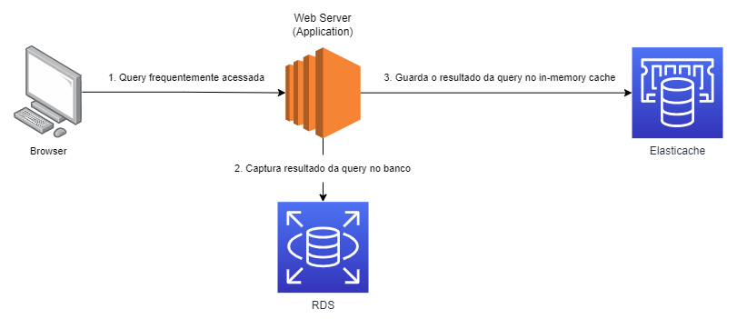

# Amazon Elasticache

&nbsp;

Amazon Elasticache is a fully managed, **In-Memory Cache service**. By using elasticache you can **speed up** your applications and databases (queries) by **caching frequently accessed data**.

O Elasticache deve ser uma opção em cenários em que temos ocorre uma busca frequente pelos mesmos dados em nossa base de dados. Para **aumentar a performance** - tempo de resposta da aplicação - e aliviar nossa base de dados, devemos armazenar o conteúdo desta querie no elasticache e apenas retorná-la sem a necessidade de consultar a base de dados.

- Os dados armazenados no elasticache são do tipo key/value pair.

> Um ponto importante para nos atentarmos é o tempo em que o resultado das queries ficarão em *cache* em vez de consultar o banco de dados.

## How it works

Na primeira execução, a query frequentemente acessada irá capturar o resultado diretamente do banco de dados, cachear estes dados no elasticache e retornar ao usuário.

Porém, em uma segunda solicitação a essa mesma query, ele não irá mais solicitar ao banco de dados já retornando o conteúdo cacheado, sendo muito mais performático e não onerando nossa base, como podemos ver na imagem abaixo.

## Compatibility 

- Memcached
- Redis

### MemcacheD

Opção mais **simples**, deve ser utilizada quando o objetivo é apenas para utilização do In-Memory cache.

> Horizontal scaling.

### Redis

Opção mais **sofisticada** com features enterprise com persistência, replicação, Multi-AZ e failover.

Possível também suporte a ordenação, ranqueamento de dados e utilização de tipos complexos de dados como listas e hashes.

#### Comparison

| Feature | MemcacheD | Redis |
| ------- | --------- | ----- |
| Horizontal Scaling | YES | YES |
| Persistence | NO | YES |
| Replication | NO | YES |
| Multi-AZ | NO | YES |
| Sorting & Ranking | NO | YES |
| Complex types | NO | YES |

## When should you use Elasticache?

**Frequently accessed heavy read workloads**

- Devemos utilizar utilizar o elasticache quando temos uma carga de leitura muito grande no banco em que os dados que não são frequentemente alterados.

## When you shouldn't use Elasticache?

**Heavy write workloads**

 - Quando o banco de dados está sofrendo com grande workloads de escrita, neste caso devemos escalar nosso banco.

**OLAP Queries**

 - Quando estamos tendo um grande fluxo de consultas analíticas, neste caso devemos utilizar um data warehouse, como Redshift.

## Tips

- O Elasticache Redis é sempre uma opção mais completa que o Elasticache MemcacheD. 

- O Elasticache Redis possibilita permite habilitarmos o Cluster Mode para aumento de disponibilidade (availability) e confiabilidade (reliability).

- O Elasticache deve ser uma opção nos seguintes cenários:
    1. Read-Heavy workloads.
    2. Compute-Intensive workloads.

- Comparando serviços com features de caching e o Elasticache:
    - Entre o Elasticache e adicionar RDS Read Replicas, o Elasticache é a opção mais performática e menos custosa.
    - Entre o Elasticache e Load Balancer Stickness, o Elasticache é mais indicado devido ser um serviço totalmente gerenciado para armazenamento de conteúdo em cache.