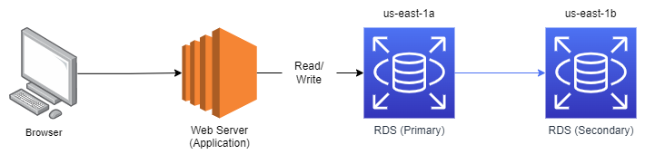
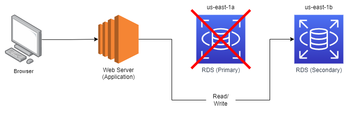
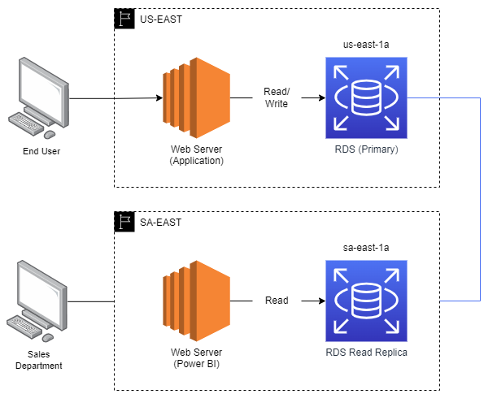

# Amazon RDS - Relational Database Service

&nbsp;

Amazon RDS is a relational database service at AWS. Using RDS is possible to setup, operate and scale relational databases in the cloud.

## Engines

Atualmente as engines suportadas pelo RDS são:

- Amazon Aurora w/ PostgreSql
- Amazon Aurora w/ MySQL
- PostgreSql
- MySQL
- SQL Server
- MariaDB
- Oracle

> Amazon Aurora é a única engine *serverless*

## OLTP (Online Transaction Processing)

RDS é uma ótima opção quandos estamos tratando com o processamento de diversas pequenas transações como, por exemplo, capturar o status de um pedido, uma transação bancária, um pagamento ou até o agendamento de uma viagem. O RDS não deve ser utilizado para OLAP, neste caso, usar uma solução de *data warehousing* com o Amazon RedShift.

## Features

- [**Multi-AZ**](./README.md#multi-az) - disaster recovery (DI) & automatic failover capabilities
- [**Read Replicas**](./README.md#read-replicas) - performance
- **Automated Backups**

### Multi-AZ

Basicamente, o Multi-AZ é uma feature para **disaster recovery**.

Todas as operações que ocorrerem em nossa base de dados **primária** serão **replicados automaticamente** para uma instância **secundária**, assim temos sempre as duas bases *'syncadas'*.

Caso ocorra algum **problema** em nossa instância **primária** ou por algum motivo perdermos a conexão com a nossa instância primária, a **própria aws** se encarrega de automaticamente redirecionar (***automatic failover***) o fluxo para a instância **secundária** enquanto a primária não retorna, como podemos ver na imagem abaixo.

### Read Replicas

Já as Read Replicas devem ser usadas para um ganho de performance. Elas são basicamente cópias da nossa base de dados primária, porém, somente leitura.

Cada read replica possuirá seu próprio endpoint em que podemos nos conectar diretamente, sendo um de seus papeis de *desafogar* nossa base de dados primária.

> Uma premissa para conseguirmos habilitar as read replicas é estar com o **automated backup ligado**.

Importante lembrar também que as read replicas podem ser na **same AZ**, **cross-AZ** e **cross-region**.

