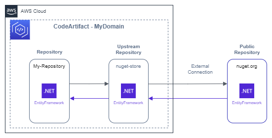

# AWS CodeArtifact

&nbsp;

AWS CodeArtifact is **developer tool service** reponsible the **management of packages** used during development.

Ele pode ser usado para armazenar *packages* da própria companhia/empresa quanto ser uma ponte para outros provedores de pacotes.

Através dele podemos definir quais as versões de pacotes são permitidas dentro da organização, pode ser entendido como "versões licenciadas".

## External Connection

A captura de pacotes públicos pode ser feita através da criação de um ***upstream repository*** com uma **conexão externa** para capturar pacotes de um repositório público de pacotes como nuget.org, npmjs.com, maven.org, entre outros.

