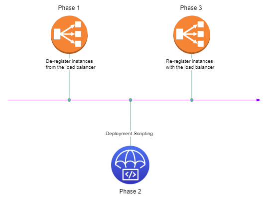

# AWS CodeDeploy


<p>&nbsp;</p>

AWS CodeDeploy is a **developer tool service** responsible to **automate the deployment** of new versions of your code to your production environment.

Através do CodeDeploy, podemos automatizar todo o fluxo de deployment para os nossos ambientes em especial para o ambiente de produção.

## AppSpec File

É através do arquivo AppSpec, iremos informar os parâmetros necessários para a configuração do nosso *deploy*.

Ele é um arquivo com a extensão .yml (```appspec.yml```), dividido em 4 seções: **version**, **os**, **files** e **hooks**.

Este arquivo deverá sempre estar na raíz (root) da nossa *revision/version*.

Uma boa prática é criarmos pastas específicas que irão possuir arquivos, *scripts* ou configurações necessárias durante o deploy. Como pode ser visto no exemplo abaixo, estamos utilizando os *folders*: ```Config/```, ```Source/``` e ```Scripts/```, todos localizados também na raiz.

Exemplo de um arquivo **appspec.yml** para deploy de instâncias EC2:


> Dependendo da aplicação de destino que iremos realizar o *deploy*, o arquivo *appspec.yml* pode variar um pouco.

## Deployment Types and their peculiarities

### In-Place Deployment

O *In-Place deployment* prevê a conservação de cada instância que está no ar, pois ele irá remover momentaneamente o POD do load balancer durante o processo de download e deploy do novo código nesta mesma instância. Após o novo código ser *deployado*, esta instância será adicionada novamente ao load balancer para ser consumida. O que acaba implicando em capacidade reduzida durante o processo de *deployment*, pois sempre uma instância estará "fora do ar" para baixar a nova versão.

Caso o novo código esteja com problemas e tenha a necessidade de se realizar um *roll back*, é necessário fazer o deploy novamente da antiga versão em cada POD, implica novamente em capacidade reduzida.


### Blue/Green Deployment

O *Blue Green deployment* prediz que continuaremos com os antigos PODs que estão com a versão antiga por um tempo (blue), enquanto verificamos que o novo código está OK. Enquanto subimos novos PODs com a nova versão e apenas apontamos para eles. Dessa forma, não possuímos capacidade reduzida e em caso de roll back, basta apontarmos o load balancer para as antigas instâncias e pronto.

> Apesar dos benefícios, importante lembrar que teremos 2 ambientes coexistindo, rodando lado a lado, enquanto validamos a nova versão. Implicando em maiores custos.


#### Comparisons

**In-Place** | **Blue/Green** |
------------ | -------------- |
**Capacidade reduzida** durante deployment | **Sem redução** na capacidade |
Não possui suporte para lambdas | Possui suporte para lambdas |
***Roll back*** prevê ***re-deploy*** | Apenas **apontar** para o ***environment*** desejado, não requer '*re-deploy*' |
Deve ser usado para o primeiro *deploy* de suas peças | Não é aconselhável em ambientes produtivos |
Preço se mantém | **Custos adicionais** por ter 2 *environments* rodando lado a lado |

## Run Order / Lifecycle Event Hooks

### Deployment Phases

> For In-Place Deployment

Para facilitar o entendimento do fluxo, vamos separar em três fases, a primeira fica responsável por remover a instância do *target group* do *load balancer*, para que possamos iniciar o processo de *deploy* da nova versão, a segunda etapa envolve todos os scripts que realizam de fato o *deploy* e a última fase fica responsável por adicionar novamente a instância no *target group* do *load balancer*.



> Importante lembrar que cada um destes steps são opcionais, devemos adicionar conforme a necessidade de cada aplicação/deployment.

Abaixo, podemos ver detalhadamente todos os steps envolvidos em cada uma das fases no processo de *deploy*.

#### **Phase 1 - De-register from load balancer**


#### **Phase 2 - Deployment scripting**


#### **Phase 3 - Re-register from load balancer**


## Tips

- Os tipos de deployment disponíveis pelo CodeDeploy são: In-Place e Blue/Green Deployment.

- O primeiro deploy deve ser sempre usando o tipo In-Place.

- O arquivo usado pelo CodeDeploy chama-se appspec.yml e deve estar sempre na raíz (root) da aplicação (revision).

- O CodeDeploy é compatível com OnPremises, Lambda, EC2 e ECS, porém não permite integração com o Kubernetes.

- Se tivermos uma integração entre o CodeDeploy e o CodeCommit, devemos adicionar na execution role do EC2 uma policy que permita a utilização da seguinte action: Codecommit:GitPull. Dessa forma, o EC2 conseguirá se conectar no CodeCommit para capturar o código fonte a ser deployado.

- Em caso de rollback automático ou manual, o CodeDeploy irá realizar o deploy da última revision que subiu corretamente primeiramente nas instâncias que falharam.
    > Este novo deploy irá gerar um novo Deployment Id.

- O CodeDeploy Agent é um software disponibilizado pelo próprio CodeDeploy a ser instalado e configurado nas instâncias ec2. Através dele o CodeDeploy realizará o deployment das novas revisions, além de possuir configurações para o backup das últimas revisions e de log files.

- Para definirmos diferentes configurações de deployments como o tipo de instância que será deployado, podemos criar vários CodeDeploy Deployment Groups.