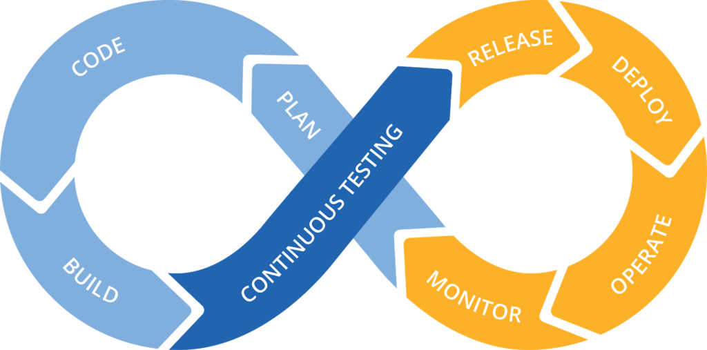

# CI/CD - Continuous Integration / Continuous Deployment

&nbsp;

Basicamente o conceito de CI/CD aborda os temas de **Continuous Integration** e **Continuous Deployment**.

*Continuous Integration* significa integração contínua, como o próprio nome diz, o objetivo é que nosso repositório de armazenamento de código (git) esteja integrado e automatizado seguindo algumas boas práticas de mercado. Essa prática pressupõe que alterações em nossas branches deverão '*triggar*' *pipelines* responsáveis por '*buildar*', testar e por fim realizar o *deploy* em nossos ambientes.

*Continuous Deployment* significa deployment contínuo, ou seja, essas pequenas alterações no código deverão ser automatizadas para promoção deste novo código principalmente em ambiente produtivo sem impactos. Dessa forma, a promoção de novas versões é realizada de forma mais rápida e segura a partir da padronização e automatização destes processos.

A AWS apresenta os 4 serviços abaixo para configuração e utilização do CI/CD:

## [CodeCommit](./CodeCommit/README.md)

É o serviço responsável por ser basicamente o **git da própria amazon** (repositório de códigos da amazon).

## [CodeBuild](./CodeBuild/README.md)

Serviço responsável pela **automatização da compilação do código**, por **rodar os testes** (unitários, funcionais...) e **produzir os artefatos** (packages) que serão '*deployados*' pelo CodeDeploy.

## [CodeArtifact](./CodeArtifact/README.md)

Serviço responsável por ser o **gerenciador de artefatos** internos ou externos.

## [CodeDeploy](./CodeDeploy/README.md)

Serviço responsável pela **automatização do *deployment*** do artefato gerado no step do CodeBuild. 

> Pode realizar o deploy para instância EC2, lambdas e até deployments em seu ambiente on-premises.

## [CodePipeline](./CodePipeline/README.md)

Serviço responsável pelo **gerenciamento do fluxo de implantação inteiro**, desde a alteração do código no repositório, realização do build do artefato, verificação dos testes e *deployment*.

## AWS Docs

- [AWS CI/CD Whitepaper](https://docs.aws.amazon.com/pdfs/whitepapers/latest/practicing-continuous-integration-continuous-delivery/practicing-continuous-integration-continuous-delivery.pdf)