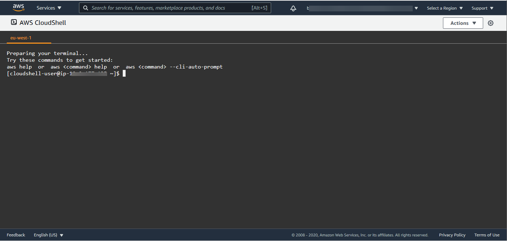

# CloudShell

&nbsp;

CloudShell is a developer tool service which it can launch a pre-authenticated shell at your browser directly from the AWS management console with some pre-installed features as the aws cli without configuring or installing nothing as you can see at the image below.

