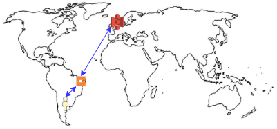

# Amazon Cloudfront

&nbsp;

Cloudfront is Amazon's own **Content Delivery Network (CDN)**.

Em outras palavras, é um sistema de servidores distribuídos para entrega de páginas ou qualquer outro conteúdo da internet, como vídeos, fotos e assim por diante.

## How Cloudfront works and why should i use it?

Basicamente, o cloudfront permite a entrega de conteúdo de forma mais performática por todo o globo através do uso dos Edge Locations e da própria rede interna da Amazon (Amazon's  backbone network), assim aonde quer que o usuário esteja, ele estará consumindo o conteúdo através do edge location mais próximo, não sendo necessário se comunicar com a origem do conteúdo.

### TTL (Time To Live)

O nome dado ao tempo em que o conteúdo fica cacheado é **TTL** e o valor é de **1 dia**.

> Importante lembrar que caso necessário, é possível invalidar o conteúdo (atualizar o conteúdo *'cacheado'*), porém você será cobrado por isto.

### Workflow

Como pode ser visto acima, o usuário não está consumindo o conteúdo direto da origem, mas sim do edge location mais próximo, melhorando a experiência e performance do serviço.

## Terminology

- **Cloudfront Edge Location** - Local (físico) aonde o conteúdo será cacheado.
- **Cloudfront Origin** - Origem (fonte), pode ser: s3 bucket, ec2 instance, elb, route 53 ou até um web server próprio.
- **Cloudfront Distribution** - Nome da configuração dá distruição de conteúdo já configurada.