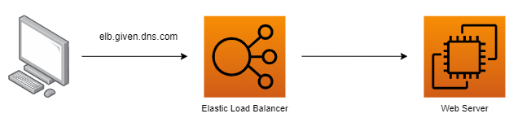

# Amazon Route 53

&nbsp;

Amazon Route 53 is Amazon's highly available and scalable own **Domain Name Service (DNS) service**.

Para a certificação apenas temos que lembrar que podemos utilizar o Amazon Route 53 para criar DNSs que redirecionem para nossas aplicações, load balancers, entre outros.

#### Example

No exemplo abaixo podemos ver que a aplicação está sendo chamada através do próprio DNS do load balancer.

Já no cenário abaixo, modificamos um pouco a arquitetura da aplicação para chamarmos um DNS mais amigável configurado via Amazon Route 53 e ainda definimos uma política de roteamento também no próprio route 53.

## Tips

- O Apex Zone ou Naked Domain Name leva em consideração o nome do DNS, por exemplo, se criarmos um DNS chamado example.com, ele será o nosso Apex Zone.

- O CName (Canonical Name) pode ser usado para redirecionar o Apex Zone para outros domínios, porém nunca para o próprio Apex Zone. No exemplo acima, poderíamos usar o CName para redirecionar o example.com para www.example.com.

- O Alias Record já pode ser utilizado para referenciar o próprio Apex Zone. No exemplo acima, poderíamos utilizar para referenciar o próprio example.com.

- 