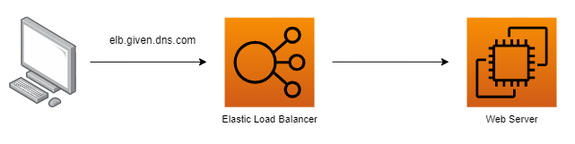
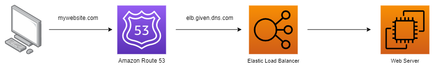

# Amazon Route 53

&nbsp;

Amazon Route 53 is Amazon's highly available and scalable own **Domain Name Service (DNS) service**.

Para a certificação apenas temos que lembrar que podemos utilizar o Amazon Route 53 para criar DNSs que redirecionem para nossas aplicações, load balancers, entre outros.

#### Example

No exemplo abaixo podemos ver que a aplicação está sendo chamada através do próprio DNS do load balancer.

Já no cenário abaixo, modificamos um pouco a arquitetura da aplicação para chamarmos um DNS mais amigável configurado via Amazon Route 53 e ainda definimos uma política de roteamento também no próprio route 53.

