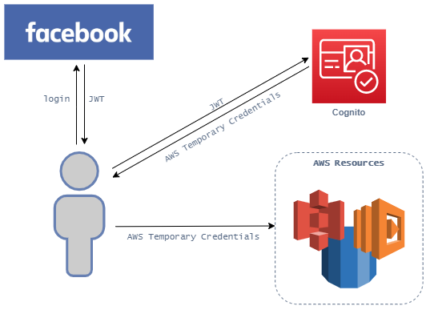

# Amazon Cognito

&nbsp;

Amazon Cognito is an **identity service** which provides a **centralized identity access management** for customers.

## Features

- [Identity Federation](#identity-federation)
- [Cognito Pools](#cognito-user-and-identity-pools)
- [Cognito Push Synchronization](#cognito-push-synchronization)

### Identity Federation

Através do Cognito, é possível realizarmos o ***sign up*** ou ***sign in*** através de **identidades federativas** como Amazon, Google, Facebook, de modo que toda a responsabilidade de autenticação e geração de credenciais seja realizada de forma independente pelo próprio Cognito, não sendo necessário nenhuma implementação pela aplicação.

O fluxo acontece conforme a ilustração abaixo, o usuário se autentica na identidade federativa, o jwt é retornado ao usuário e através do cognito, ele realiza esta troca do jwt por credenciais do IAM (*IAM credentials*) para utilização dos serviços aws desejados.

### Cognito User and Identity Pools

O **Cognito User Pools** são diretórios de usuário a qual disponiliza **funcionalidades de autenticação**, como o *SignUp* e *Login* de usuários. Ou seja, o usuário pode optar por logar-se através de um identity provider ou utilizar o cognito user pools para se autenticar-se.

Já o **Cognito Identity Pools** possuem a função de **prover acesso temporário aos recursos da aws** através de credenciais da aws temporárias (*temporary aws credentials*), para por exemplo, conceder acesso temporário a um usuário para consumir uma foto presente em um bucket s3.

Cognito User Pools | Cognito Identity Pools
------------------ | ----------------------
Autenticação | Credenciais de acesso temporário aos recursos AWS |

### Cognito Push Synchronization

O **Cognito Push Synchronization** é uma feature do Cognito que possibilita a **sincronização dos dados** dos usuários em **todos os lugares** (computador, tablet, celular, notebook...) que o usuário **tenha se logado**, mantendo os dados atualizados independentemente de qual plataforma o usuário esteja.

> A sincronização dos dados é realizada através de push notifications disparadas pelo SNS.

## Tips

- O Cognito é um serviço 100% gerenciado.

- O Cognito pode ser integrado com o Api Gateway para autenticar os usuários.

- Não é possível integrar o Cognito com o CloudFront, porém podemos nos integrar diretamente com um ALB.

## Cognito User Pool

- Através do Cognito User Pool podemos realizar o Sign Up/In de usuários além de integrar-se com external identity providers.

- O Cognito User Pool possui suporte a MFA.

## Cognito Identity Pool

- O Cognito Identity Pool pode fornecer acesso guest.