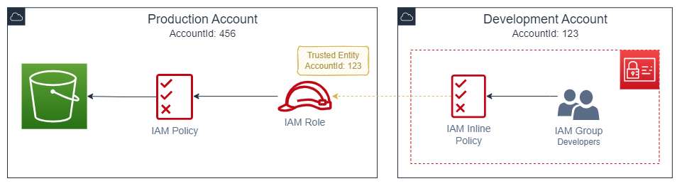
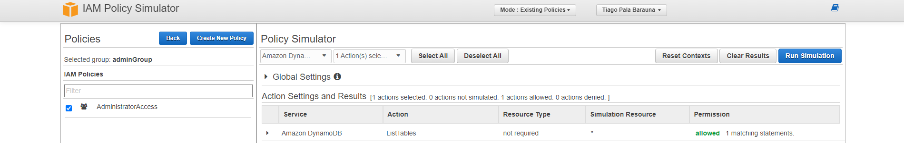

# IAM - Identity Access Management

&nbsp;

IAM is an AWS **Universal Service** responsible for user management and their level of access to the AWS Console.

- **Centralized** (Controle centralizado da conta)
- **Access** (Compartilhar acesso a conta)
- **Permissions** (Concessão de permissões granulares de acesso a conta)
- **Identity Federation** (Suporte a integração de identity providers como Google, Facebook...)

## Features

- Multi-Factor Authentication
- Temporary Access (principalmente ao acesso de arquivos temporários do s3)
- Password Policies (rotation policies - políticas de rotação de senhas)
- AWS Services Integrations
- Compliance (suporte a PCI DSS - meios de pagamento)

## Divided In

- **Users**: Pessoas
- **Groups**: Conjunto de usuários/pessoas
- **Roles**: Attach de uma "Função" para conceder um conjunto de permissões
- [**Policies**](#policies): Concessão de uma permissão específica (JSON)

> Users has not permissions when first created. Permissions need to be granted.

### Policies

#### AWS Managed Policies

As **AWS Managed Policies**, são policies **criadas e gerenciadas pela própria AWS**, elas representam ***job functions***, ou seja, permitem acesso a um ou mais recursos que se referem à aquela função específica. 

Seu objetivo é facilitar a concessão de permissões entre serviços e usuários, sem a necessidade de criar policies que muitas vezes se repetem, como por exemplo, a liberação de acesso de administrador para o serviço do EC2 que pode ser feito utilizando-se da *policy **AmazonEC2FullAccess***.

> São policies apenas leitura (*read only policies*).

#### Customer Managed Policies

As **Customer Managed Policies** são policies **gerenciadas pelo próprio usuário**, ou seja, podemos criar, atualizar e deletar caso desejarmos.

#### Inline Policies

As **Inline Policies** também são criadas e gerenciadas pelo próprio usuário, porém elas estão **vinculadas exclusivamente em um usuário, grupo ou role específico**. Não é possível compartilhar inline policies.

> Caso o usuário, grupo ou role seja excluído, a inline policy presente também será removida.

## Access Types

- **Console**
- **Programmatic Access** - Necessário para utilização do AWS CLI, SDKs e API calls

## Cross Account Access using Roles

Basicamente, para conseguirmos estabelecer um acesso entre contas, devemos seguir os passos abaixo:

Primeiramente na conta de destino, em nosso exemplo será a de conta de prod, devemos:

1. Criar uma IAM Policy que possuirá as permissões necessárias de acordo com o objetivo proposto, em nosso caso, as permissões necessárias para listar o conteúdo de um *bucket* específico.
2. Criar uma IAM Role em que a *trusted entity* deverá ser a conta que irá estabelecer o *cross-account*, para isso devemos informar o *account id* da conta de origem, em nosso exemplo a conta de *development*.

Após realizadas as configurações da conta de destino (prod), iremos realizar as seguintes configurações na conta de dev:

3. Criar um grupo de usuários.
4. Criar um usuário e vincular ao grupo criado acima.
5. Criar uma *Inline Policy* que permita o *AssumeRole* da *IAM Role* criada na conta de produção no grupo de usuários criado anteriormente.

> A parte do grupo é opcional mas fortemente indicado, porém existe a possibilidade de criarmos a *inline IAM policy* diretamente no usuário criado.
>
> Podemos também, em vez de criar uma *inline policy*, podemos criar uma *customer managed policy* e vincular (*attach*) ao grupo criado.

Finalizadas essas configurações já é possível realizar o *cross-account access*. 

Para facilitar a visualização, o fluxo ficará igual ao representado abaixo:

## Tools

### Policy Simulator

Serviço de simulação de policies em tempo real.

Link do serviço: [policysim.aws.amazon.com](https://policysim.aws.amazon.com/home/index.jsp).

#### Using Scenarios

- Verificar se determinada policy possui acesso a uma determinada ação de um serviço específico.
- Auxiliar no troubleshooting quando suspeitamos que é um problema de acesso.

> Exemplo: A imagem abaixo verifica se o grupo `adminGroup` possui acesso para `listar tabelas` no `DynamoDb`.

### Policy Generator

Serviço para criação de policies (conceder permissões)

Link do serviço: [awspolicygen.s3.amazonaws.com](https://awspolicygen.s3.amazonaws.com/policygen.html)

## Best Practices

Quando for conceder acesso a serviços, sempre opte por ***roles*** e ***policies*** com os menores níveis de acesso necessários, pois são a opção mais segura, dessa forma não é necessário utilizar as credenciais - *access key id* e *secret access key* - *hard coded* dentro de suas instâncias ec2, por exemplo.

## Tips

- Alterações em policies que estão *'attached'* a uma role são aplicadas instantâneamente.

- Podemos '*attach*' ou '*detach*' roles sem pararmos (stop) ou terminarmos nossas instâncias. Esta operação pode ser feita com a instância em execução.

- O IAM Access Analyzer permite identificarmos acessos compartilhados com external entities que caracterizam uma falha na segurança, em outras palavras devemos utilizá-lo quando queremos descobrir se estamos dando mais permissões do que o necessário para algum user, group ou role.

- O IAM Access Advisor deve ser usado para identificarmos roles que não estão mais sendo utilizas em nossa conta, aconselhando a remove-las.

- A única resource-based policy que o IAM possui são as Trust Policies.

- A root account não possui suporte ao MFA através de mensagens de texto SMS, apenas virtual/hardware MFA e U2F (dispositivo de autenticação USB).

- Os serviços/recursos responsáveis por limitar acesso na AWS são:
    1. Permissions Boundary: Managed Policy que define permissões máximas para usuários/roles.
    2. AWS Organizations Service Control Policy: Serviço que define permissões máximas para account members ou organization units (OU).

- Nas IAM Policies denies sempre sobressaem allows (denies always override allows).

- Para termos acesso compartilhado de recursos cross account devemos:
    1. Criar uma policy que possua as devidas permissões para acessar o recurso desejado na conta destino.
    2. Na conta destino, criar uma role e 'attachar' a policy acima em que a trusted entity é o AccountId da conta de origem.
    3. Na conta de origem, criar uma policy que possa fazer o AssumeRole da role criada na conta destino.
    4. Criar um usuário ou grupo e 'attachar' a policy acima na conta de origem.

