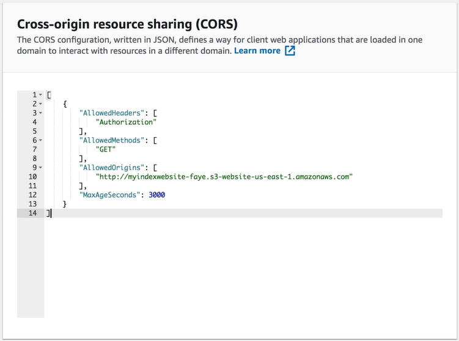

# Amazon S3 - Simple Storage Service


<p>&nbsp;</p>

Amazon S3 is a **object storage service**, that provides secure, durable and highly available objects.

Um dos diferenciais do s3, é que não temos limite de armazenamento (***unlimited storage***) e objetos individuais podem ter até 5TB.

Os arquivos são organizados dentro de **buckets**, semelhante a folders.

Os nomes dos buckets são compartilhados (**shared namespaces**), portanto devem ser únicos globamente (**globally unique**), portanto se uma pessoa já possui um bucket chamado test-bucket, você nunca conseguirá criar um bucket tendo o mesmo nome em sua conta.

> Exemplo s3 URL: https://bucket-name.s3.sa-east-1.amazonaws.com/key-name.jpg

## Components

- **Key** - Nome do objeto (arquivo).
- **Value** - Os dados que correspondem aquele objeto, geralmente um array de bytes.
- **Version ID** - Versão do objeto.
- **Metadata** - Dados dos próprios dados. Exemplo: content-type, last-modified...

## Availability & Durability

- **Disponibilidade** pode variar de acordo com o tier escolhido, entre **99.95%** e **99.99%**.

- **Durabilidade** é de **99.(11 9's)%**.

## Features

- [**Tiering/Storage Classes**](#storage-classes)
- [**Transfer Acceleration**](#transfer-acceleration)
- **Lifecycle Management**
- **Versioning**

### Storage Classes

- S3 Standard
- S3 Standard-Infrequent Access
- S3 One Zone-Infrequent Access
- S3 Glacier
- S3 Glacier Deep Archive
- S3 Intelligent Tearing

#### Comparison

| Storage Class | Availability | Durability | Number AZs | Minimum Storage Time | Use Cases |
| ------------- | ------------ | ---------- | ---------- | -------------------- | --------- |
| **S3 Standard** | 99.99% | 11 9's | >= 3 | N/A | Utilizado pela maioria das aplicações |
| **S3 Standard-Infrequent Access** | **99.9%** | 11 9's | >= 3 | 30 dias | Dados acessados ocasionalmente, porém entregues rapidamente quando solicitado | 
| **S3 One Zone-Infrequent Access** | **99.5%** | 11 9's | **1** | 30 dias | Aconselhável para dados não críticos acessados ocasionalmente, porém entregues rapidamente quando solicitado |
| **S3 Glacier** | 99.99% | 11 9's | >= 3 | 90 dias | Armazenamento (arquivamento) de longa duração, para dados que precisam ser acessados em minutos até horas |
| **S3 Glacier Deep Archive** | 99.99% | 11 9's | >= 3 | 180 dias | Armazenamento (arquivamento) extrema duração, para dados raramente acessados, com recuperação dos dados em até 12 horas |
| **S3 Intelligent Tearing** | **99.9%** | 11 9's | >= 3 | 30 dias | Aconselhável quando desconhecemos o padrão de acesso aos dados |

### Transfer Acceleration

É a principal feature do s3 para realização de uploads. Com o transfer acceleration habilitado o **upload** do arquivo é realizado no **edge location ([cloudfront](../../Networking%20%26%20Content%20Delivery/Cloudfront/README.md)) mais próximo** e através da própria rede interna da amazon, o arquivo será entregue ao s3, sendo muito **mais performático**.

## Security

Por **default**, todo novo bucket criado é **privado**. Somente o bucket owner possui permissões para subir, editar, mover e remover arquivos.

### Access Control

**Bucket Policies**

As bucket policies são **aplicadas** em **nível de bucket**, portanto se aplicam a **todos os objetos** dentro deste bucket.

> Um caso de uso, é quando desejamos compartilhar permissões de todos os arquivos do bucket para outra pessoa ou aplicação de forma simples e centralizada.

**Access Control Lists (ACL's)**

Os ACL's são aplicados a objetos individuais, podendo definir quais contas, grupos e seu respectivo nível de acesso ao arquivo. Através dos ACL's temos um controle de acesso granular, podendo conceder diferentes permissões para cada arquivo.

## Access logs

Para termos maior segurança do que está acontecendo dentro de nossos buckets, podemos habilitar o s3 access logs para logar todas as chamadas feitas para nosso bucket, sendo elas de upload, read ou delete.

> Os logs podem ficar em outro bucket, informando no momento em que estivermos habilitando esta configuração.

## Criptografia

Podemos habilitar a seguinte opção de **Server Side Encryption** e assim todos os novos arquivos já serão armazenados criptografados.

### Ways of encrypting data

- In Transit
- Server Side
- Client Side

**In Transit**

Usando uma conexão segura através do HTTPS em que os dados trafegados utilizam um dos protocolos a seguir TLS (Transport Layer Security) e SSL (Secure Sockets Layer) para fazer o upload dos arquivos.

**Server Side Encryption** 

- **SSE-S3** - Chaves gerenciadas pelo próprio S3. O padrão de criptografia usado: AES 256-bit encryption.
- **SSE-KMS** - Utiliza o serviço do KMS para gerenciamento das chaves.
- **SSE-C** - O próprio cliente (dono da conta) gerencia as chaves.

Ways to enforce *server side encryption*:

- Selecionar *'Enable' option for server-side encryption* através do ***console***.
- Criar um *statement* através das ***bucket policies*** para permitir que somente requests que possuam o *header x-amz-server-side-encryption* sejam permitidas.

**Client Side Encryption**

O próprio dono dos arquivos criptografa os dados previamente antes de realizar o upload.

Ways to enforce *client side encryption*:

- Criar um *statement* através também das ***bucket policies*** para negar todas as requisições em que o valor *aws:SecureTransport* esteja falso. Permitindo somente trafegar arquivos que sejam provenientes de uma conexão HTTPS. 

## CORS (Cross Origin Resource Sharing)

Em buckets, usualmente necessitamos capturar informações entre buckets, um exemplo é quando temos um site estático que consome imagens de um bucket, scripts de outro e assim por diante. O **CORS** deve ser **configurado** no **bucket que será consumido**, informando a origem que poderá consumir seus arquivos, como pode ser visto no exemplo abaixo. Depois da configuração do CORS, o bucket de origem já poderá consumir os arquivos solicitados normalmente.



## Supported File Formats

- Photos
- Videos
- Codes
- Documents
- Text files

## Tips

- O tamanho aconselhável para usar o S3 Multipart Upload é para arquivos com tamanho à partir de 100 MB.

- O tamanho máximo de um arquivo no S3 é de 5 TB.

- O tamanho máximo de um arquivo em uma única requisição é de 5 GB.

- O modelo de consistência do S3 é strong read-after-write para PUT e DELETE operations.

- Se o objetivo for termos server side encryption no S3, podemos habilitar o check box para criptografia no console ou criar uma bucket policy que permita somente requests que utilizem o seguinte header ```x-amz-server-side-encryption```.

- A única forma de servir conteúdo do S3 com um custom domain name é a partir do Cloudfront.

- Se quisermos restringir acesso aos folders/arquivos de cada usuário da aplicação, devemos utilizar IAM Policy Variables para conseguirmos o AccountName do próprio usuário e criarmos uma bucket policy universal que apenas habilite acesso a ele mesmo.

- Quando temos um bucket compartilhado por várias contas, por padrão a conta que fez o upload de um arquivo será owner dele. Porém, podemos alterar o S3 Bucket Ownership para o próprio default bucket owner, assim o bucket owner terá acesso a todos os arquivos presentes naquele bucket, podendo o upload ter sido feito por ele ou por qualquer outra conta.

- Sobre permissões e acessos no S3:
    1. Resource-based policies (bucket policies), ACL (Access Control Lists) e AWS IAM policies concedem apenas acesso programático.
    2. IAM Roles para ambos acessos via Console e acesso programático.

- Se em nosso bucket tivermos uma bucket policy que permita somente o upload de arquivos criptografados usando o SSE-KMS, o usuário necessitará em suas policies da action KMS:GenerateDataKey, para conseguir gerar a DataKey para criptografar o arquivo no momento do upload.

- Referente a replicação de arquivos para outro bucket no S3, as lifecycle rules não serão replicadas.

- Cross-Region Replication ou Same-Region Replication podem ser configurados em bucket level, prefix level e object level.

- Se estivermos trabalhando com um bucket com SSE-S3 devemos criar uma bucket policy que permita somente o header ```x-amz-server-side-encryption:AES256```.

- Entre os tipos de criptografia server side do S3, a única que obrigatoriamente necessita de uma conexão segura é a SSE-C, enquanto para SSE-S3 E SSE-KMS a comunicação segura é opcional.

- Se quisermos capturar apenas uma parte das informações de um item armazenado no s3, por exemplo um arquivo csv composto por 10 colunas e quisermos capturar apenas 3 colunas podemos usar o S3 Select.

- Se tivermos uma aplicação web que está sendo servida pelo S3 através do static website hosting e o usuário estiver recebendo timeouts, provavelmente faltou configurar as bucket policies.

- Se estivermos utilizando a SSE-C, iremos controlar as próprias chaves de criptografia e para realizarmos por exemplo o upload de um arquivo criptografado no s3, devemos passar juntamente a chave na requisição.

- O versionamento é referente a um bucket e quanto é habilitado, absolutamente, TODOS os arquivos dentro daquele bucket serão versionados.