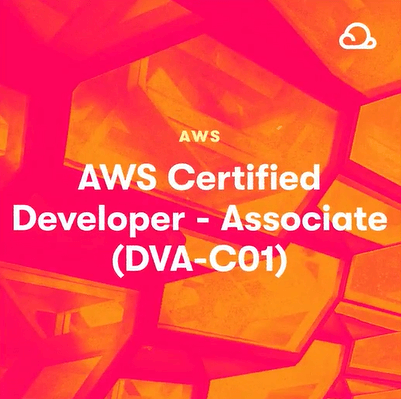

# AWS Certified Developer Associate - Tiago Pala study guide

&nbsp;

Projeto de estudos pessoal criado durante a preparação para certificação AWS Certified Developer Associate.

A divisão dos temas e serviços abordados seguem o mesmo padrão dos domínios da AWS, com o objetivo de facilitar a procura dos mesmos dentro do console da AWS.

Os conteúdos apresentados são basicamente um material de apoio para consulta baseadas na minha própria experiência com os demais serviços.

## AWS CLI

- [AWS CLI](./CLI/README.md)

## Serverless Services

- [Serverless](./Serverless/README.md)

## Before The Exam

Após o estudo aprofundado em cada um dos serviços apresentados nos domínios presentes neste material, antes de realizar o exame, é importante a leitura dos seguintes *FAQs* e *WhitePapers* para relembrar pontos vistos anteriormente além de ter outra perspectiva de alguns serviços, abordagens e implementações.

### FAQ's (Frequently Asked Questions)

Para facilitar a leitura vamos dividir em nos seguintes domínios:

#### Serverless

- [Lambda FAQ](https://aws.amazon.com/lambda/faqs/?nc1=h_ls)
- [Api Gateway FAQ](https://aws.amazon.com/pt/api-gateway/faqs/)
- [DynamoDB FAQ](https://aws.amazon.com/pt/dynamodb/faqs/)
- [Elasticache FQA](https://aws.amazon.com/pt/elasticache/faqs/)
- [S3 FAQ](https://aws.amazon.com/pt/s3/faqs/)

#### Developer Tools - CI/CD

- [CodeCommit FAQ](https://aws.amazon.com/pt/codecommit/faqs/)
- [CodeBuild FAQ](https://aws.amazon.com/pt/codebuild/faqs/)
- [CodeDeploy FAQ](https://aws.amazon.com/pt/codedeploy/faqs/)
- [CodePipeline FAQ](https://aws.amazon.com/pt/codepipeline/faqs/)

#### Security

- [IAM FAQ](https://aws.amazon.com/pt/iam/faqs/)
- [Cognito FAQ](https://aws.amazon.com/pt/cognito/faqs/)
- [KMS FAQ](https://aws.amazon.com/pt/kms/faqs/)

#### Automation & Monitoring

- [Beanstalk FAQ](https://aws.amazon.com/pt/elasticbeanstalk/faqs/)
- [Cloudformation FAQ](https://aws.amazon.com/pt/cloudformation/faqs/)
- [CloudWatch FAQ](https://aws.amazon.com/pt/cloudwatch/faqs/)
- [X-Ray FAQ](https://aws.amazon.com/pt/xray/faqs/)

#### Containers

- [ECS FAQ](https://aws.amazon.com/pt/ecs/faqs/)
- [ECR FAQ](https://aws.amazon.com/pt/ecr/faqs/)

#### Messaging & Streaming

- [SQS FAQ](https://aws.amazon.com/pt/sqs/faqs/)
- [Kinesis FAQ](https://aws.amazon.com/pt/kinesis/data-streams/faqs/)

### AWS White Papers

- [Practicing Continuous Integration and Continuous Delivery on AWS](https://docs.aws.amazon.com/pdfs/whitepapers/latest/practicing-continuous-integration-continuous-delivery/practicing-continuous-integration-continuous-delivery.pdf)
- [Blue/Green Deployments on AWS](https://d1.awsstatic.com/whitepapers/AWS_Blue_Green_Deployments.pdf)
- [Introduction to DevOps on AWS](https://d1.awsstatic.com/whitepapers/AWS_DevOps.pdf)
- [AWS Serverless Multi-Tier Architectures (lambda/api gateway)](https://d1.awsstatic.com/whitepapers/AWS_Serverless_Multi-Tier_Architectures.pdf)
- [Docker on AWS](https://d1.awsstatic.com/whitepapers/docker-on-aws.pdf)
- [Running Containerized Microservices on AWS](https://d1.awsstatic.com/whitepapers/DevOps/running-containerized-microservices-on-aws.pdf)
- [Optimizing Enterprise Economics with Serverless Architectures](https://docs.aws.amazon.com/pdfs/whitepapers/latest/optimizing-enterprise-economics-with-serverless/optimizing-enterprise-economics-with-serverless.pdf#optimizing-enterprise-economics-with-serverless)
- [Security Pillar](https://docs.aws.amazon.com/pdfs/wellarchitected/latest/security-pillar/wellarchitected-security-pillar.pdf)

## Tips

- Os principais recursos para guardar a sessão do usuário são: DynamoDb, elasticache com sticky sessions e rds.

- A AWS necessita de pelo menos 5 semanas para começar a gerar previsões de budget.